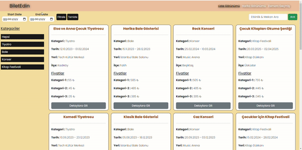
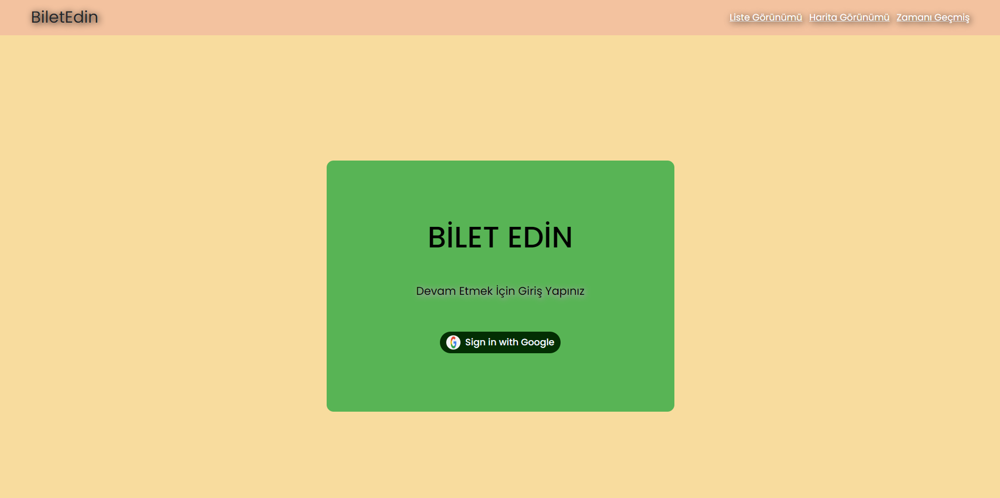
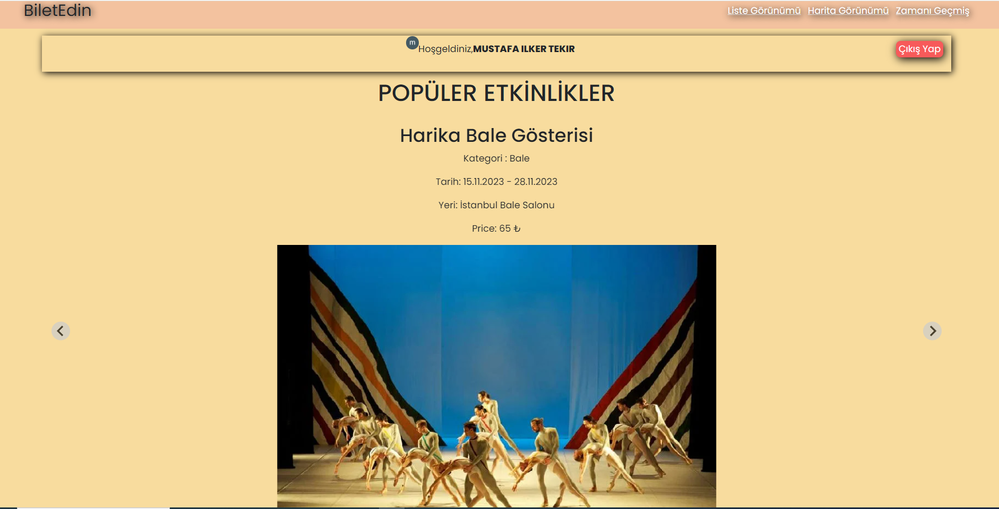
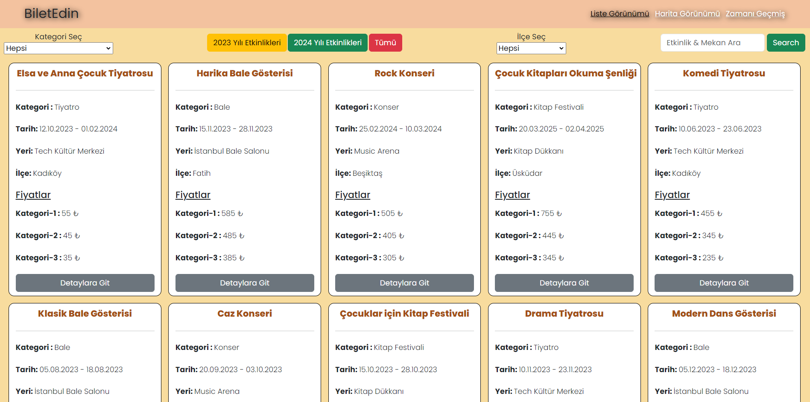
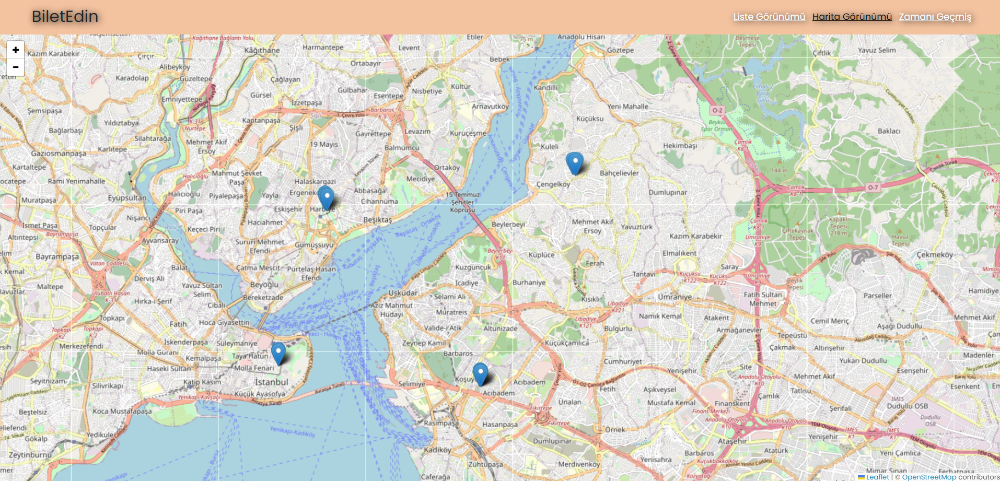
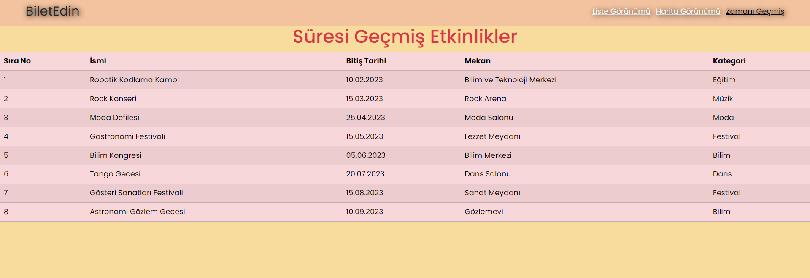

# Tech Career Finish Project

## Istanbul Etkinlikleri Websitesi
Bu proje, İstanbul'da gerçekleşen etkinlikleri gösteren bir web uygulamasıdır. Kullanıcılar etkinlikleri liste görünümünde, harita görünümünde keşfedebilir ve zaman aşımına uğramış etkinlikleri görüntüleyebilir. Ayrıca, kullanıcılar Google hesaplarıyla giriş yaparak kişiselleştirilmiş özelliklere erişebilirler.

## Kullanılan Teknolojiler
* React: Kullanıcı arayüzleri oluşturmak için kullanılan bir JavaScript kütüphanesi.
* Vite: Hızlı bir frontend geliştirme aracı.
* Firebase: Kimlik doğrulama ve veri depolama için kullanılan bir backend-hizmet platformu.
* Axios: Sunucuya istek yapmak için kullanılan promise tabanlı bir HTTP istemcisi.
* JSON Server: Test ve prototipleme için sahte bir REST API.
* React Router: Bir React uygulamasındaki farklı bileşenler arasında gezinme işlemleri için deklaratif bir yol.
* React Leaflet: Leaflet harita kütüphanesi için bir React sarmalayıcı.
* Splide: React için hafif, duyarlı bir kaydırıcı/carousel kütüphanesi.
* Bootstrap: Uygulamayı stilize etmek için popüler bir CSS çerçevesi.
* Sass: Stil yönetimi için kullanılan CSS ön işleyici olan Sass kullanılmıştır. Bu, stil sayfalarını daha modüler hale getirir ve tekrar kullanılabilirliği artırır.

## Proje Yapısı
Proje, farklı bileşenlere ve sayfalara ayrılmıştır:

### Bileşenler:

* Header: Farklı görünümlere yönlendiren üst gezinme çubuğu.
* Card: Detaylara sahip bir etkinlik kartını temsil eder.
* Filter: Etkinlikleri kategori, tarih ve konuma göre filtreleme seçenekleri sunar.
* OutdatedTable: Zaman aşımına uğramış etkinlikleri içeren bir tabloyu görüntüler.
* ShareButtons: Etkinlik paylaşımı için sosyal medya paylaşım düğmeleri.

### Sayfalar:

* AuthPage: Kullanıcılara Google hesaplarıyla giriş yapma imkanı tanır.
* Home: Popüler etkinlikleri gösteren ana sayfa ve hoş geldin mesajı.
* ListView: Etkinlikleri liste görünümünde filtreleme seçenekleriyle görüntüler.
* MapList: Harita üzerinde etkinlikleri interaktif işaretleyicilerle gösterir.
* OutDated: Zaman aşımına uğramış etkinlikleri listeleyen sayfa.
* Detail: Belirli bir etkinlik hakkında detaylı bilgi gösterir.
* PlaceEvents: Belirli bir yerdeki etkinlikleri gösterir.

## Kullanım

* Ana sayfayı ziyaret ederek popüler etkinlikleri görebilir ve Google hesabınızla giriş yaparak kişiselleştirilmiş özelliklere erişebilirsiniz.
* Etkinlikleri liste görünümünde, harita görünümünde keşfedin ve zaman aşımına uğramış etkinlikleri görüntüleyin.
* Kategori, tarih ve konuma göre etkinlikleri filtrelemek için filtre seçeneklerini kullanın.
* Bir etkinlik kartına tıklayarak detaylı bilgileri görüntüleyin.
* Sağlanan paylaşım düğmelerini kullanarak etkinlikleri sosyal medyada paylaşın.
* Proje hakkında sorularınız veya katkılarınız varsa lütfen konu veya çekme isteği göndererek katkıda bulunun.

## Ekran Görüntüleri

* DetailPage

* AuthPage

* HomePage

* ListPage

* MapPage

* OutdatedPage

